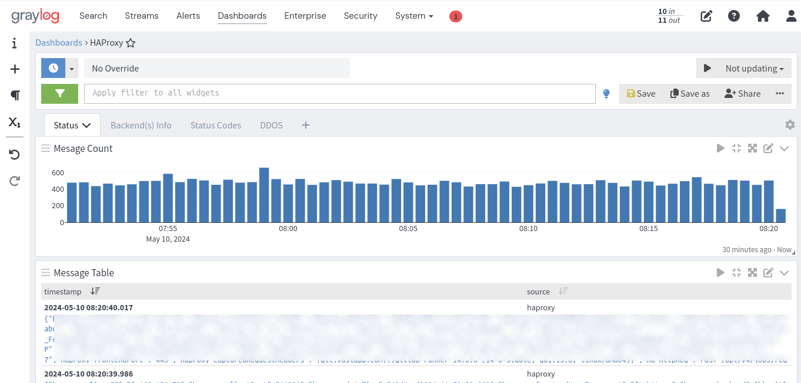
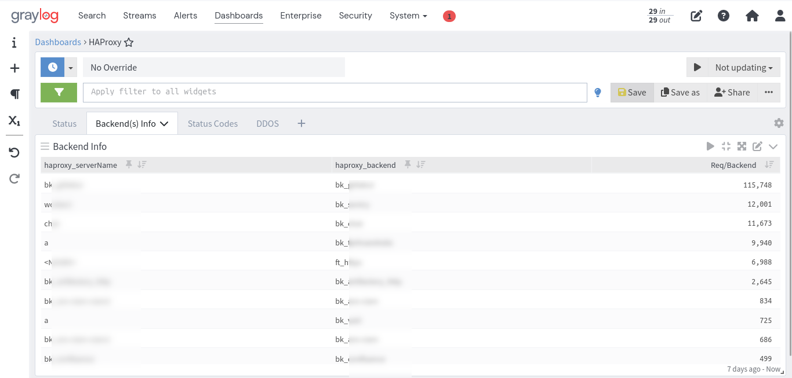
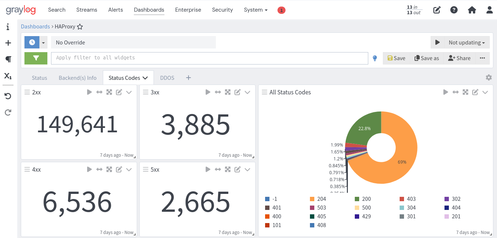
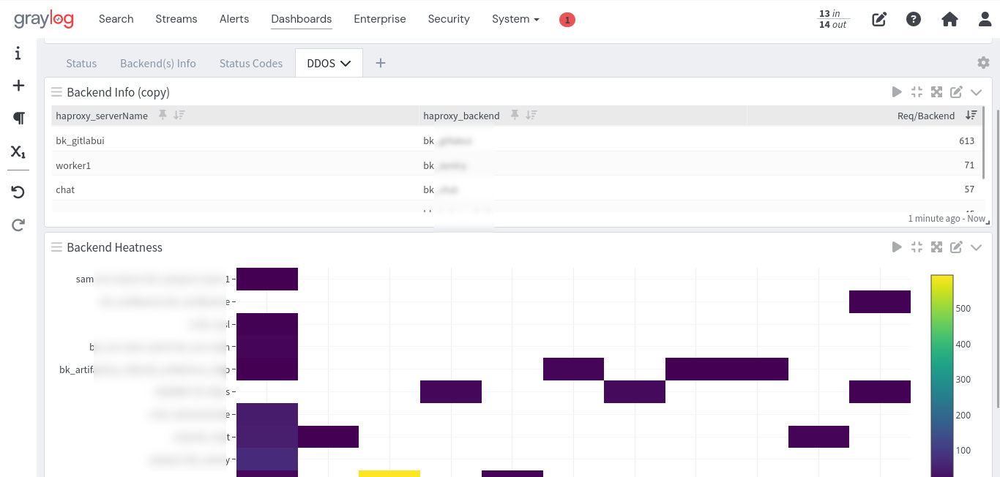

# Graylog HAProxy Content Pack

This content pack is designed to enhance HAProxy monitoring within Graylog, providing comprehensive insights into backend performance and security. It includes:

	- Backend Status: Real-time monitoring of each backend's status (UP/DOWN).
	- Most Used Backend: Identification of the backend with the highest request rate.
	- DDoS Attack Detection: Alerts for potential DDoS attacks by analyzing backend call rates in the last 10 seconds.
	- Backend Heatmap: Visual representation of backend performance over time, highlighting usage patterns and potential bottlenecks.

Deploy this content pack to gain actionable intelligence from your HAProxy logs, ensuring high availability and security of your services.

## HAProxy Log Format

To facilitate the integration of HAProxy logs with Graylog, you need to adjust the log format in your HAProxy configuration to match the structure expected by Graylog. Here's a detailed guide on how to do this:

1. **Open your HAProxy configuration file**: This file is typically named `haproxy.cfg` and is located in the `/etc/haproxy/` directory or a similar path depending on your system.

2. **Locate the `global` section**: Within this section, you'll find the `log` directive. This is where you specify the destination for your HAProxy logs.

3. **Modify the `log-format` directive**: You need to adjust the `log-format` directive to include the specific fields that Graylog expects. The provided format is already tailored for Graylog, but ensure it matches the exact requirements of your Graylog setup. Here's the format you should use:

    ```
    log-format {"haproxy_clientIP":"%ci","haproxy_clientPort":"%cp","haproxy_dateTime":"%t","haproxy_frontendNameTransport":"%ft","haproxy_backend":"%b","haproxy_serverName":"%s","haproxy_Tw":"%Tw","haproxy_Tc":"%Tc","haproxy_Tt":"%Tt","haproxy_bytesRead":"%B","haproxy_terminationState":"%ts","haproxy_actconn":%ac,"haproxy_FrontendCurrentConn":%fc,"haproxy_backendCurrentConn":%bc,"haproxy_serverConcurrentConn":%sc,"haproxy_retries":%rc,"haproxy_srvQueue":%sq,"haproxy_backendQueue":%bq,"haproxy_backendSourceIP":"%bi","haproxy_backendSourcePort":"%bp","haproxy_statusCode":"%ST","haproxy_serverIP":"%si","haproxy_serverPort":"%sp","haproxy_frontendIP":"%fi","haproxy_frontendPort":"%fp","haproxy_capturedRequestHeaders":"%hr","ha_httpReq":"%r","host":"%[capture.req.hdr(0)]"}
    ```

4. **Save your changes**: After adjusting the `log-format` directive, save your changes to the configuration file.

5. **Reload or restart HAProxy**: For the changes to take effect, you need to reload or restart the HAProxy service. This can typically be done with one of the following commands:

    - To reload HAProxy: `sudo systemctl reload haproxy`
    - To restart HAProxy: `sudo systemctl restart haproxy`

6. **Verify the log format in Graylog**: After HAProxy has been reloaded or restarted, check your Graylog dashboard to ensure that the logs are being received and parsed correctly according to the new format.

By following these steps, you should be able to successfully configure HAProxy to send logs in a format that Graylog can understand and process. This will enhance your ability to monitor and analyze traffic through your HAProxy setup.


# Screenshots






